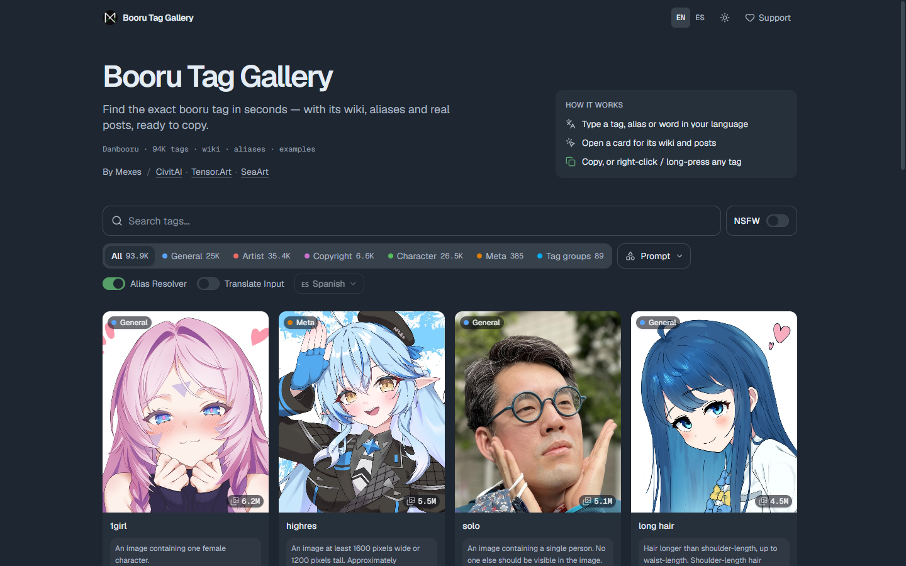
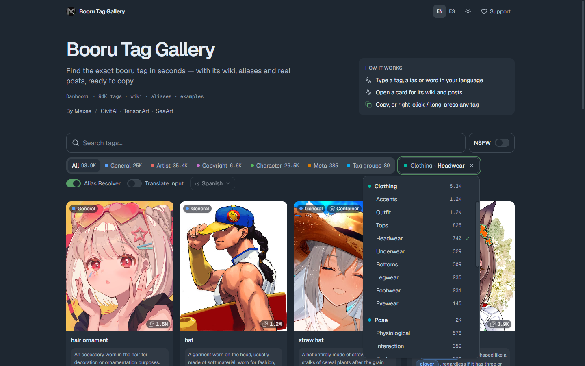
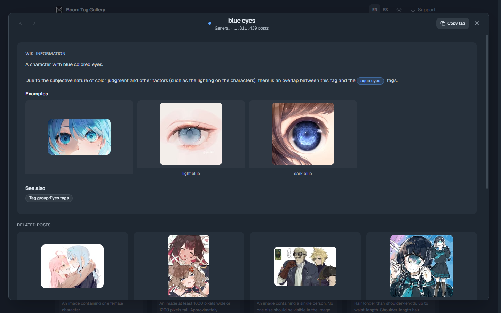
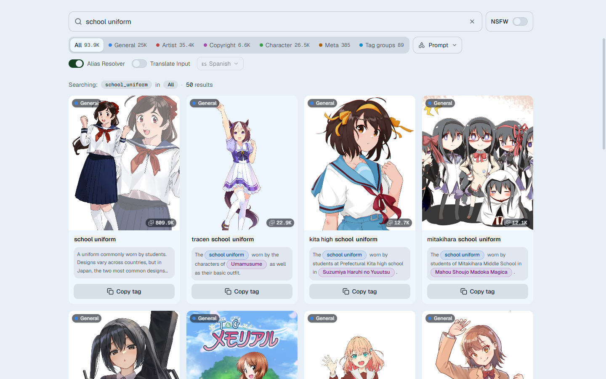
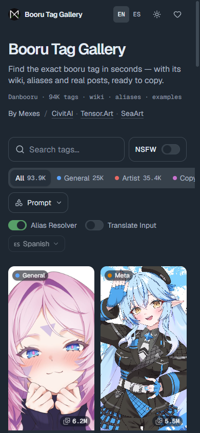

<p align="center">
  
</p>

<h1 align="center">Booru Tag Gallery</h1>

<p align="center">
  Find the exact Danbooru tag in seconds — with its wiki, aliases and real posts, ready to copy.
</p>

<p align="center">
  
  
  
  
  
</p>

<p align="center">
  
</p>

Booru Tag Gallery is a search tool for Danbooru tags. Type a tag, an alias or a word in your own language and you get matching tags as cards, each with a preview image, a short wiki excerpt and a button to copy it. Opening a card shows the full wiki, example images and recent posts for that tag.

The whole tag list (about 94,000 tags) ships with the site, so searching is instant and works without hitting the Danbooru API on every keystroke.

## Features

**Searching**
- Fuzzy search with typo tolerance, autocomplete and alias resolution (`sole_female` → `1girl`)
- Type in Spanish or any other DeepL language and the query is translated to the booru term
- Filter by category: General, Artist, Copyright, Character, Meta, or curated tag groups
- Filter General tags by what they describe in a prompt: clothing, pose, appearance, scenery and more, down to subcategories like *Clothing › Headwear* or *Appearance › Eyes*

**Browsing**
- Each card shows a preview, the post count and the start of the tag's wiki
- The tag view has the full wiki with linked tags, example images and related posts; it opens as a modal or at `/tags/:name`
- Click any post to see it larger along with all of its tags

**Copying**
- A *Copy tag* button on every card and in the tag view
- Right-click or long-press any tag chip to copy it; copied tags use spaces instead of underscores

**Other**
- Sensitive previews are hidden unless you switch NSFW on
- Light and dark themes, English and Spanish interface
- Canonical URLs, Open Graph, JSON-LD and generated sitemaps

## Screenshots

<table>
  <tr>
    <td width="50%"></td>
    <td width="50%"></td>
  </tr>
  <tr>
    <td align="center"><sub>Filtering by prompt category</sub></td>
    <td align="center"><sub>Tag view</sub></td>
  </tr>
  <tr>
    <td></td>
    <td align="center"></td>
  </tr>
  <tr>
    <td align="center"><sub>Search results, light theme</sub></td>
    <td align="center"><sub>Mobile</sub></td>
  </tr>
</table>

## Getting started

```bash
git clone https://github.com/Mexes-GM/booru-tags-gallery.git
cd booru-tags-gallery
npm install
npm run dev
```

Then open [http://localhost:5173](http://localhost:5173). To build for production:

```bash
npm run build     # type-check and build into dist/
npm run preview   # serve the build locally
```

## How it works

The tag list lives in `public/data/`: about 94,000 Danbooru tags with their category, post count, aliases and prompt category, plus a pre-built [Fuse.js](https://fusejs.io) index and Danbooru's tag groups. Search runs in a Web Worker against these files, so it never waits on the network.

Wiki pages, preview images and posts come from the Danbooru API, and are only requested when a card scrolls into view or a tag is opened.

## Project structure

```
src/
├── components/   # Pages, search bar, tag cards, modals
├── hooks/        # Search, pagination, image loading
├── services/     # Danbooru API client
├── workers/      # Local search worker
├── context/      # Theme, NSFW filter, modals
└── i18n/         # English and Spanish
api/              # DeepL translation endpoint (Vercel)
netlify/          # Same endpoint for Netlify
public/data/      # Tag data and search index
```

Built with [React 18](https://react.dev), [TypeScript](https://www.typescriptlang.org/), [Vite 7](https://vitejs.dev), [Tailwind CSS 4](https://tailwindcss.com), [Fuse.js](https://fusejs.io), [react-i18next](https://react.i18next.com), [React Router](https://reactrouter.com) and [lucide-react](https://lucide.dev).

## Deploying your own copy

Import the repository into **Vercel** or **Netlify**; both are already configured. Two environment variables are optional:

- `DEEPL_API_KEY` — enables translating searches typed in other languages. Without it, search still works in English.
- `VITE_SITE_URL` — your site's public address (e.g. `https://booru-tags.example.com`). It sets canonical and social-preview URLs, and lets the build generate a sitemap.

## License

MIT — see [LICENSE](LICENSE).
